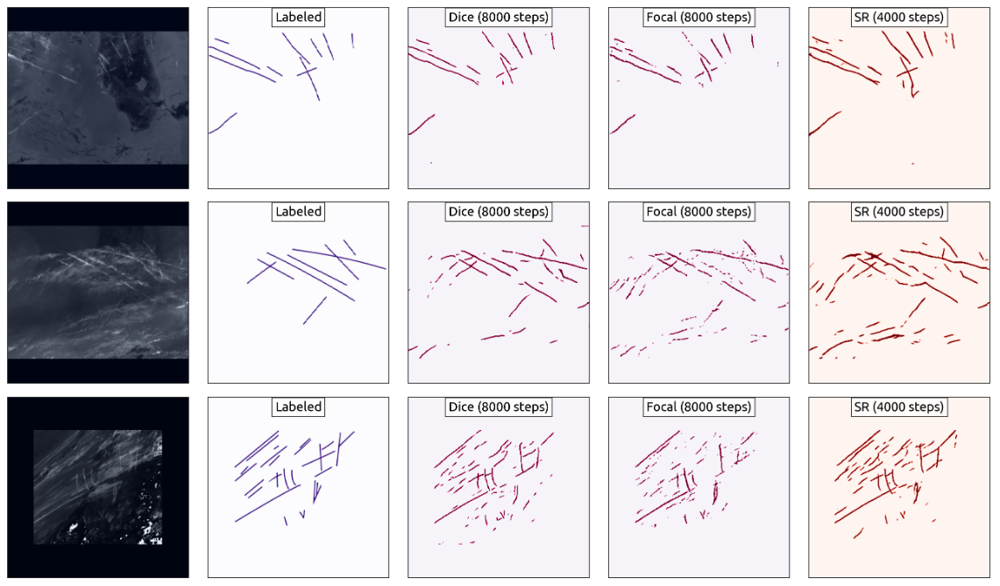
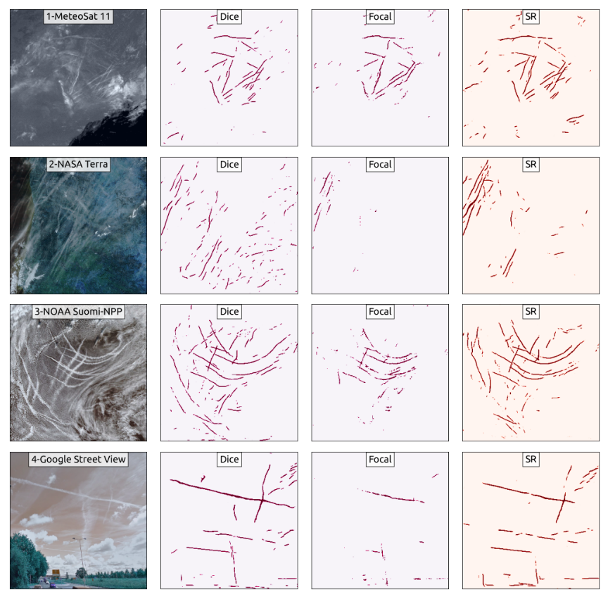

# Neural networks models for contrail detection and segmentation


Introducing an open-source project that implements contrail segmentation neural network models in PyTorch. 

These models are constructed using augmented transfer learning, wherein multiple image augmentations are applied to a pre-trained ResUNet model. Consequently, the model can be efficiently fine-tuned using only a small set of labeled satellite images. 

To enhance contrail detection through contrail information in Hough space, **a new loss function, SR Loss**, has been developed and incorporated, aiming at further optimizing the contrail detection process.

## Contrail detection examples

The following set of images shows examples of contrails detected with different models trained with Dice, Focal, and SR loss functions:




The following set of images shows examples of contrails detected from different image sources, which are different from the GOES-16 images that are used in the model training. It demonstrates that the model performs well on other image sources.




## Dependencies

* PyTorch
* segmentation_models_pytorch
* opencv
* scikit-learn


## Setup

You should already have a work mamba/conda environment. If not, follow this tutorial to set it up: https://youtu.be/Ket0WUTm5JU?t=47


### Step 1: Create a conda environment 

Note: replace `mamba` with `conda` for slower installation :)


```
mamba create -n contrail python=3.10 -c conda-forge
```

### Step 2: Install dependencies


* For PyTorch users with CUDA 11.8 (recommended):

    ```
    conda activate contrail
    mamba install pytorch pytorch-cuda=11.8 -c pytorch -c nvidia
    pip install segmentation-models-pytorch albumentations
    ```

* For PyTorch users without CUDA:

    ```
    conda activate contrail
    conda install pytorch cpuonly -c pytorch
    pip install segmentation-models-pytorch albumentations
    ```


### Step 3: Models

[Optional] If you want to train the model, take a look and run the `train.py` script.

You can also download the already trained model weights from: https://surfdrive.surf.nl/files/index.php/s/n1b0L2qfu2PZ6d3

Save the downloaded models in a folder called `models` under the `data` directory.


### Step 4: Visualize contrail detection

The notebook `detect.ipynb` provides examples for loading models and examples for detecting contrails.


## What about TensorFlow?

The script `tensorflow_model/contrail_tf_keras.py` shows a basic implementation of the segmentation model in TensorFlow. Note this code is not fully tested.

To test your model in TensorFlow, the following dependencies have to be installed:

```
conda activate contrail
mamba install tensorflow scikit-learn matplotlib
pip install segmentation-models albumentations
```
